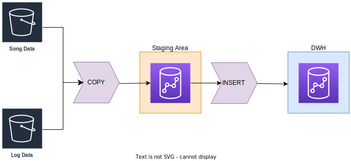

# Redshift Data Warehouse

## Introduction

A music streaming startup, Sparkify, has grown their user base and song database and want to move their processes and data onto the cloud. Their data resides in S3, in a directory of JSON logs on user activity on the app, as well as a directory with JSON metadata on the songs in their app.

## Scripts

The scripts are in the `src/` folder.

| Script            | Description                                                                                                                          |
| ----------------- | ------------------------------------------------------------------------------------------------------------------------------------ |
| `sql_queries.py`  | is where you'll define you SQL statements, which will be imported into the two other files below.                                    |
| `create_table.py` | is where you'll create your fact and dimension tables for the star schema in Redshift.                                               |
| `etl.py`          | is where you'll load data from S3 into staging tables on Redshift and then process that data into your analytics tables on Redshift. |

## Project Dependencies

To install the dependencies it is necessary to have the Python package manager `pip` and run the following command:

```bash
pip install -r requirements.txt
```

## Project Steps

1. AWS Infrastructure
   
   1. Create IAM Role for Redshift.
   
   2. Atribuir permissão `AmazonS3ReadOnlyAccess` à IAM Role criada.
   
   3. Assign `AmazonS3ReadOnlyAccess` permission to created IAM Role.
   
   4. Open port 5439 for Redshift Cluster access.

2. Dimensionl Modeling
   
   1. Model fact and dimension tables.
   
   2. Create staging area and fact and dimension tables in Redshift.

3. ETL Pipeline
   
   1. Extract from S3 bucket music and log database.
   
   2. Load the data in the staging area.
   
   3. Process and insert processed data into the Data Warehouse fact and dimension tables.

## Infrastructure

### Prerequisites

- Credentials for accessing AWS services.

### AWS Services

| AWS Services | Description                                                                                                            |
| ------------ | ---------------------------------------------------------------------------------------------------------------------- |
| IAM          | Identity and Access Management (IAM) is a web service for securely controlling access to Amazon Web Services services. |
| S3           | Object storage service                                                                                                 |
| Redshift     | Fully managed, petabyte-scale data warehouse service in the cloud.                                                     |

### Execution

The `config/dwh.cfg` file has the credentials to access the AWS account and the necessary configurations to create the services. For the script to work perfectly it is necessary to change this file.

```python
python infra/redshift_infra.py
```

## Data Sources

There are 3 datasets that reside in S3. Here are the S3 links for each:

- Song data: `s3://udacity-dend/song_data`
- Log data: `s3://udacity-dend/log_data`
- This third file `s3://udacity-dend/log_json_path.json`contains the meta information that is required by AWS to correctly load `s3://udacity-dend/log_data`

### Song Dataset

- Song data: `s3://udacity-dend/song_data`

The first dataset is a subset of real data from the [Million Song Dataset](http://millionsongdataset.com/). Each file is in JSON format and contains metadata about a song and the artist of that song. The files are partitioned by the first three letters of each song's track ID. For example, here are file paths to two files in this dataset.

```
song_data/A/B/C/TRABCEI128F424C983.json
song_data/A/A/B/TRAABJL12903CDCF1A.json
```

And below is an example of what a single song file, `TRAAAAK128F9318786.json`, looks like:

```json
{
  "artist_id": "ARJNIUY12298900C91",
  "artist_latitude": null,
  "artist_location": "",
  "artist_longitude": null,
  "artist_name": "Adelitas Way",
  "duration": 213.9424,
  "num_songs": 1,
  "song_id": "SOBLFFE12AF72AA5BA",
  "title": "Scream",
  "year": 2009
}
```

### Log Dataset

The second dataset consists of log files in JSON format generated by this [event simulator](https://github.com/Interana/eventsim) based on the songs in the dataset above. These simulate app activity logs from an imaginary music streaming app based on configuration settings.

The log files in the dataset you'll be working with are partitioned by year and month. For example, here are file paths to two files in this dataset.

```
log_data/2018/11/2018-11-12-events.json
log_data/2018/11/2018-11-13-events.json
```

And below is an example of what the data in a log file, 2018-11-12-events.json, looks like.

```json
{
  "artist": null,
  "auth": "Logged In",
  "firstName": "Walter",
  "gender": "M",
  "itemInSession": 0,
  "lastName": "Frye",
  "length": null,
  "level": "free",
  "location": "San Francisco-Oakland-Hayward, CA",
  "method": "GET",
  "page": "Home",
  "registration": 1540919166796,
  "sessionId": 38,
  "song": null,
  "status": 200,
  "ts": 1541105830796,
  "userAgent": "\"Mozilla/5.0 (Macintosh; Intel Mac OS X 10_9_4) AppleWebKit/537.36 (KHTML, like Gecko) Chrome/36.0.1985.143 Safari/537.36\"",
  "userId": "39"
}
```

### Log Json Meta Information

And below is what data is in `log_json_path.json`.


## Schema for Song Play Analysis

### Fact Table

1. **songplays** - records in event data associated with song plays i.e. records with page `NextSong`
   - *songplay_id, start_time, user_id, level, song_id, artist_id, session_id, location, user_agent*

#### Dimension Tables

2. **users** - users in the app
   - *user_id, first_name, last_name, gender, level*
3. **songs** - songs in music database
   - *song_id, title, artist_id, year, duration*
4. **artists** - artists in music database
   - *artist_id, name, location, lattitude, longitude*
5. **time** - timestamps of records in **songplays** broken down into specific units
   - *start_time, hour, day, week, month, year, weekday* 

### Dimensional Modeling


### Optimizing Queries Performance

Read more at [Distribution Key and Sort Key](https://www.integrate.io/blog/amazon-redshift-distkey-and-sortkey/).

- start_time- sortkey, distkey 

- user_id - sortkey

- start_time - distkeys, sortkey

- song_id - sortkey

- artist_id - distkeys

### Create tables

To create the tables run the `src/create_tables.py` script. The SQL queries that will be executed are in the `src/sql_queries.py` file.

```python
python src/create_tables.py
```

## ETL Pipeline

In this step, the database of songs and logs that are stored in the S3 bucket will be extracted, loaded in the staging area of Redshift and later transformed into dimensional tables and stored in the final destination, which is the DWH Redshift so that the analytics team be able to find insights into the music users are listening to.


========================

### ETL Execution

Run the load in the staging area and feed the DWH analytical tables:

```python
python src/etl.py
```
